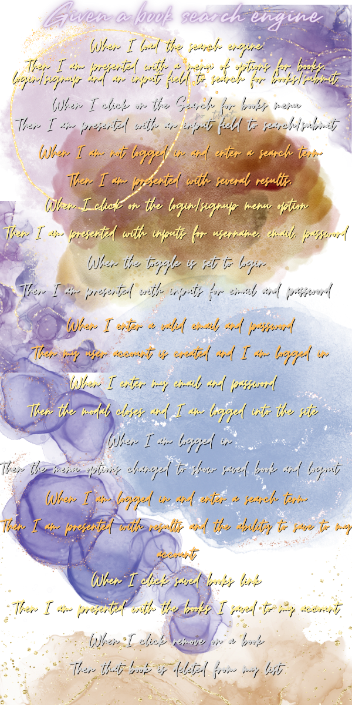
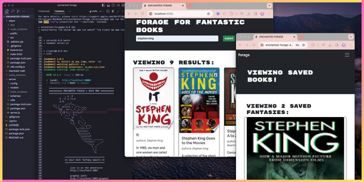

<p align="center">

</p>

[](https://opensource.org/licenses/MIT)
[](https://nodejs.org/en)
[](https://expressjs.com/)
[](https://react.dev/)
[](https://www.mongodb.com/)
[](https://www.apollographql.com/)
[](https://heroku.com)
[](https://canva.com/)
[](https://vitejs.dev/)

<p align="left">
  
</p>

### 

- [OVERVIEW](#overview)
  - [*user story*](#user-story)
  - [*acceptance criteria*](#accpetance-criteria)
  - [*fantasy list*](#fantasy-list)
- [INSTALLATION](#installation)
- [USAGE](#usage)
  - [*screenshot*](#screenshot)
  - [*demo*](#demo)
- [TESTING](#testing)
- [SOURCES](#sources)
- [LICENSE](#license)
- [LINKS](#links)
- [CONNECT](#connect)

### 

`ENCHANTED FORAGE` is an interactive book search engine built with a [GraphQL](https://www.apollographql.com/) API and Apollo Server. The app is built using [MERN Stack](https://www.mongodb.com/mern-stack) - with a [React](https://react.dev/) **front end**, [MongoDB](https://www.mongodb.com/) **database**, and [Node.js](https://nodejs.org/en)/[Express.js](https://www.npmjs.com/package/express) **server and API**.

>The [.npmrc](https://docs.npmjs.com/cli/v10/configuring-npm/npmrc) file will set config values specific to this project, and ensures the app will deploy properly to [Heroku](https://www.heroku.com).


### 
<!-- <p align="center">
  
</p> -->

### 
<!-- <p align="center">
  
</p> -->

### 
<!-- <p align="center">
  
</p> -->

#

### 

The application is invoked using the following commands:

##### *Clone the repository in your local development enviornment*

```
git clone https://github.com/christiecamp/enchanted-forage.git
```

##### *Navigate to the CLI and input:*

```javascript
npm i
```
```javascript
npm run dev
```
#

### 

**INSTRUCTIONS:**

1. Open the Integrated Terminal and follow the [installation](#installation) guidelines.

2. Interact with `ENCHANTED FORAGE` through your local enviorment, or open the [application]() deployed on [Heroku](https://heroku.com/home).

3. Signup by providing an email address & creating a username/password.

4. **Search for books** by keyword, author, title, etc.

5. *View*, *save*, & *delete* your selected books in **VIEW FANTASIES**.

6. *Logout* to leave application.


##### view [demo videos](#demo) for further help


### 
             
##### *screenshot demonstrates `ENCHANTED FORAGE's` back end, local browser, & deployed application on **Heroku***

<p align="center">

</p> 


### 


#

### 

Here's a list of technologies used:

1. [Node.js](https://nodejs.org/en) - an open-source, cross-platform JavaScript runtime environment.

2. [Express.js](<(https://expressjs.com)>) - a minimal and flexible Node.js web application framework that provides a robust set of features for web and mobile applications.

3. [Apollo Server](https://webpack.js.org/) - an open-source, spec-compliant **GraphQL server** that's compatible with any **GraphQL client**, including [Apollo Client]().
    * [apollo-server-express]()

4. [Apollo Client]()

4. [GraphQL](https://graphql.org/) - 

5. [MongoDB]()

6. [Mongoose]()

7. [React]()
      * [react-bootstrap]()
      * [react-dom]()
      * [react-router-dom]()
      * [@types/react]()
      * [@types/react-dom]()

8. [eslint]()
  * [eslint-plugin-react]()
  * [eslint-plugin-react-hooks]()
  * [eslint-plugin-react-refresh]()

9. [vite]()

10. [brypt]()

11. [jsonwebtoken]()

12. [jwt-decode]()

13. [Concurrently](https://www.npmjs.com/package/concurrently) - a Node.js tool that runs multiple commands concurrently.

14. [Nodemon](https://www.npmjs.com/package/nodemon) - a Node.js tool that helps develop applications by automatically restarting the node application when file changes in the directory are detected.

15. [Heroku](https://heroku.com) - used to deploy, manage, and scale the application.


### 

##### [mit license](./LICENSE)

### 

##### [*github repo*](https://github.com/christiecamp/enchanted-forage)

##### [*deployed app*]()

### 

[](https://github.com/christiecamp/enchanted-forage)

<a href="mailto:christiecamphoto@gmail.com">

</a>